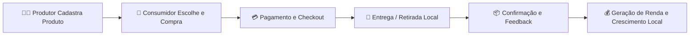

Excelente, Camila 🌱 — essa explicação muda **completamente o posicionamento** do projeto.
Não é “só um sistema técnico”, mas sim uma **iniciativa social e económica com impacto real**, e o README pode (e deve) transmitir isso com mais força e propósito.

Aqui está uma **versão profissional do teu README.md**, redesenhada para refletir o **espírito de startup de impacto local**, mantendo toda a parte técnica completa e organizada.
👉 Perfeita para colocar no **GitHub, site institucional ou proposta de incubação**.

---

````markdown
# 🌍 SIDES Mercado

**SIDES Mercado** é uma **startup de impacto social e tecnológico** criada para **impulsionar o desenvolvimento local**, **fortalecer o comércio eletrônico de base comunitária** e **gerar renda sustentável** para pequenos produtores e agricultores.  

A plataforma conecta **produtores rurais** diretamente a **consumidores e empresas**, promovendo transparência, inclusão digital e dinamização da cadeia produtiva local.

---

## 🎯 Missão

Promover o **desenvolvimento econômico sustentável** e **inclusivo**,  
através de tecnologia acessível que **digitaliza o comércio local**,  
fortalece a **economia rural** e aproxima **produtor e consumidor final**.

---

## 💡 Visão

Ser a principal plataforma moçambicana de **comércio agrícola digital**,  
com foco em **valorização do produto local**, **eficiência logística** e **impacto social positivo**.

---

## ❤️ Valores

- 🌱 **Sustentabilidade** – valorizamos o uso responsável dos recursos locais.  
- 🤝 **Cooperação** – fortalecemos o ecossistema produtivo rural.  
- 💻 **Inovação** – utilizamos tecnologia para transformar realidades.  
- 📈 **Inclusão e Geração de Renda** – ampliamos oportunidades nas comunidades.  
- 🛒 **Comércio Justo** – aproximamos quem produz de quem consome.

---

## 🏗️ Estrutura do Projeto

O SIDES Mercado é composto por **duas camadas principais**:

| Camada | Tecnologia | Descrição |
|---------|-------------|------------|
| 🖥️ **Frontend** | React + Vite | Interface do utilizador, com rotas, carrinho e checkout funcional |
| ⚙️ **Backend** | Node.js + Express + MySQL | API REST segura, com JWT, gestão de produtos, pedidos e utilizadores |

---

## 🚀 Como Rodar o Projeto

### 📦 Requisitos

- Node.js 18+
- npm 9+
- MySQL 8.0+
- Navegador moderno (Chrome, Edge, Firefox)

---

### 🖥️ Frontend

1. Acesse o diretório:
   ```bash
   cd SIDES/Frontend
````

2. Instale as dependências:

   ```bash
   npm install
   ```
3. Garanta o roteador:

   ```bash
   npm install react-router-dom
   ```
4. Rode em modo de desenvolvimento:

   ```bash
   npm run dev
   ```

---

### ⚙️ Backend

1. Vá para o diretório:

   ```bash
   cd SIDES/Backend
   ```

2. Crie o arquivo `.env`:

   ```env
   DB_HOST=localhost
   DB_PORT=3306
   DB_USER=root
   DB_PASSWORD=
   DB_NAME=sides_mercado
   JWT_SECRET=chave_super_segura_aqui
   JWT_EXPIRES_IN=7d
   ```

3. Instale as dependências:

   ```bash
   npm install
   ```

4. Inicie o servidor:

   ```bash
   npm run dev
   ```

---

## 🧱 Estrutura das Pastas

`
SIDES/
├── Frontend/
│   └── src/
│       ├── App.js
│       ├── main.jsx
│       ├── components/
│       │   ├── Header.js
│       │   └── Footer.js
│       ├── context/
│       │   ├── CartContext.js
│       │   ├── HelpContext.js
│       │   └── CategoryContext.js
│       └── pages/
│           ├── Home.js
│           ├── Sobre.js
│           ├── Produtos.js
│           ├── ProdutorCadastro.js
│           └── Solucoes.js
├── Backend/
│   ├── config/
│   │   └── database.js
│   ├── controllers/
│   ├── middleware/
│   ├── models/
│   ├── routes/
│   ├── uploads/images/
│   └── server.js
`

---

## 🛒 Fluxo do Carrinho

1. **Adicionar produtos**
   Nas páginas **Home**, **Produtos** ou **Categorias**.
2. **Gerir o carrinho**

   * Aumentar / diminuir quantidades
   * Remover produtos
   * Limpar carrinho
3. **Finalizar compra**

   * Em `/checkout`, escolher **Entrega** ou **Retirar localmente**
4. **Receber confirmação**

   * O sistema envia resumo e atualiza o pedido no backend.

---

## 🔗 Principais Rotas da API

| Método   | Endpoint              | Descrição                   |
| -------- | --------------------- | --------------------------- |
| `GET`    | `/api/produtos`       | Lista todos os produtos     |
| `GET`    | `/api/produtos/:slug` | Ver detalhes do produto     |
| `POST`   | `/api/produtos`       | Criar novo produto *(auth)* |
| `PUT`    | `/api/produtos/:id`   | Atualizar produto *(auth)*  |
| `DELETE` | `/api/produtos/:id`   | Remover produto *(auth)*    |
| `POST`   | `/api/auth/login`     | Autenticação JWT            |
| `POST`   | `/api/pedidos`        | Criar pedido                |
| `GET`    | `/api/pedidos`        | Listar pedidos              |
| `POST`   | `/api/upload`         | Upload de imagem *(auth)*   |

---

## 📦 Tecnologias Utilizadas

| Categoria             | Stack                                  |
| --------------------- | -------------------------------------- |
| **Frontend**          | React, React Router, Context API, Vite |
| **Backend**           | Node.js, Express, MySQL, JWT           |
| **Autenticação**      | JSON Web Token                         |
| **Banco de Dados**    | MySQL + mysql2                         |
| **Upload de Imagens** | Multer                                 |
| **Outros**            | dotenv, slugify, cors                  |

---

## 🌾 Impacto Esperado

* 💼 **Geração de renda** para produtores locais
* 🧑‍🌾 **Digitalização da agricultura familiar**
* 🛒 **Comércio eletrônico comunitário acessível**
* 🚚 **Redução de intermediários e desperdício**
* 🌍 **Fortalecimento das cadeias produtivas locais**

---

## 📊 Fluxo do Sistema



---

## 👩‍💻 Autoria

Desenvolvido por **Camila Cristina**
🚀 Projeto **SIDES Mercado** — Startup moçambicana de inovação social e tecnológica.
📍 Foco em **desenvolvimento local**, **sustentabilidade** e **economia digital rural**.

---

## 🏁 Status do Projeto

| Módulo                              | Status                |
| ----------------------------------- | --------------------- |
| Frontend (React + Vite)             | ✅ Concluído           |
| Backend (Node.js + Express + MySQL) | ✅ Funcional           |
| Upload de Imagens                   | ✅ Ativo               |
| Sistema de Carrinho                 | ✅ Operacional         |
| Painel Admin / Produtor             | 🚧 Em desenvolvimento |
| Integração API ↔️ UI                | 🚀 Em fase final      |

---

## 📜 Licença

© 2025 **SIDES Mercado**
Uso académico e de inovação social — todos os direitos reservados.

```

---

### 💬 O que esta versão faz melhor:

✅ Apresenta o **impacto social e económico** do projeto  
✅ Traz **missão, visão e valores** de uma startup  
✅ Mostra a **estrutura técnica completa**  
✅ É elegante e **profissional para GitHub, incubadoras e portfólios**  
✅ Usa um tom que reflete **inovação, propósito e tecnologia sustentável**


